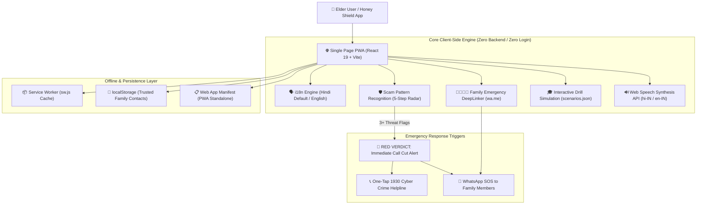
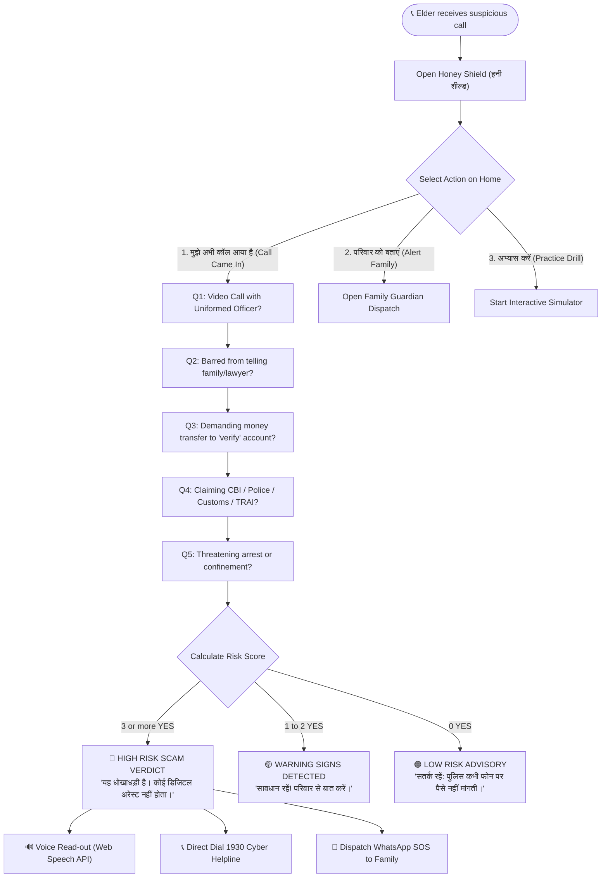

# 🍯 Honey Shield (हनी शील्ड)
### *Senior Citizen Protection Shield Against "Digital Arrest" & Cyber Scams in India*

[](https://github.com/sxketh128/honey-sheild-)
[](https://react.dev/)
[](https://tailwindcss.com/)
[](tel:1930)
[_%26_English-orange?style=for-the-badge)](src/i18n.js)

---

## 📌 Executive Summary & The Problem

Across India, ruthless cybercrime syndicates are preying upon elderly pensioners through **"Digital Arrest" scams**. Impersonating senior officers from the **CBI, Mumbai/Delhi Police, Customs, Narcotics Control Bureau (NCB), and TRAI**, fraudsters:
1. Threaten victims over high-pressure **WhatsApp / Skype video calls** with fake uniforms and staged interrogation backdrops.
2. Fabricate illegal seizure notices involving narcotics or illegal courier parcels tied to the senior citizen's Aadhaar.
3. Enforce **absolute secrecy** by barring victims from calling their children, spouses, or lawyers under threat of instant imprisonment.
4. Extort life savings by forcing elders to transfer lakhs to fake **"RBI Verification / Escrow Accounts"**.

> [!CAUTION]
> **Indian Law Fact**: There is **NO** provision for "Digital Arrest" in the Code of Criminal Procedure (CrPC) or Bharatiya Nagarik Suraksha Sanhita (BNSS). Real law enforcement agencies **NEVER** conduct trials over video calls, demand secrecy from families, or verify innocence via bank transfers.

**Honey Shield** is a mobile-first, privacy-respecting Progressive Web App engineered specifically for senior citizens. It operates completely **client-side, requires no login, functions 100% offline, and empowers elders with intuitive decision trees, one-tap family alerting, and voice reassurance.**

---

## 🏛️ System Architecture



---

## 🔄 User Decision & Scam Detection Flowchart



---

## ⚡ Key Features

### 1. 🛡️ Urgent Inbound Call Checklist (`/checklist`)
- **Single-Question Step View**: High-contrast, giant 72px Yes/No buttons so elders are never overwhelmed.
- **Calm & Breathe Modal**: A dedicated mindfulness pause feature acknowledging that fraudsters intentionally induce panic and hurry.
- **3-Tier Risk Verdict**:
  - **RED (≥3 Flags)**: Alerts senior to immediately hang up, guarantees their safety, and provides one-tap 1930 dialing.
  - **AMBER (1-2 Flags)**: Precautionary warning advising family consultation before sharing any details.
  - **GREEN (0 Flags)**: Safety confirmation reiterating core banking security rules.
- **Voice Read-Out (Web Speech API)**: Clear spoken Hindi (`hi-IN`) and Indian English (`en-IN`) for seniors with reduced vision.

### 2. 👨‍👩‍👧‍👦 Family Emergency Dispatcher (`/family`)
- **Pre-configured Trusted Contacts**: Preloaded with demo contacts (`बेटी प्रिया`, `बेटा राहुल`) persisted in `localStorage`.
- **Custom Caller / Agency Metadata**: Optional input field allowing elders to note caller names or badge IDs.
- **One-Tap WhatsApp Deep Linking**: Formats emergency SOS messages via `https://wa.me/` requesting immediate phone contact and preventing fund transfers.
- **Confirmation Dialogue**: Visual assurance showing which family members have been alerted.

### 3. 🎓 Interactive Digital Arrest Simulation (`/drill`)
- **7-Stage Real-Life Threat Scenarios**: Fully data-driven through `src/scenarios.json`.
- **Branching Decision Mechanics**: Choices for giving OTPs, transferring money, or disconnecting and calling family.
- **Immediate Educational Feedback**: Green approval for correct actions and red explanations detailing deceptive psychological tactics.
- **3 Golden Rules of Indian Cyber Safety**:
  1. *No 'Digital Arrest' exists in Indian law.*
  2. *No government agency demands secrecy from your family.*
  3. *No official verifies bank accounts through money transfers.*

### 4. 👴 Senior-Centric UX & Accessibility (WCAG 2.1 AAA)
- **Minimum 20px Typography**: Legible headings and body text throughout.
- **Minimum 56px - 76px Touch Targets**: Generous button padding suitable for unsteady hands or tremors.
- **High-Contrast Warm Aesthetics**: Tailored palette (`#fff9ef` warm background, `#09152e` navy, `#feb316` honey amber, `#ba1a1a` warning red).
- **Haptic Feedback**: Gentle vibration patterns on supported Android and mobile devices.

### 5. 📴 100% Offline PWA (Zero Backend / Zero Login)
- Instant loading via Service Worker (`public/sw.js`).
- Complete privacy: no biometric, contact, or financial data ever leaves the user's device.
- Installable on mobile home screens as a native application via `public/manifest.json`.

---

## 🛠️ Tech Stack & Directory Overview

```text
honey-shield/
├── index.html                 # PWA Shell, Google Fonts, Material Symbols, Tailwind Config
├── public/
│   ├── manifest.json          # PWA Web App Manifest
│   ├── shield-icon.svg        # Honey Shield Vector Branding
│   └── sw.js                  # Service Worker Cache & Offline Strategy
├── src/
│   ├── components/
│   │   └── Header.jsx         # Responsive Header, Back Button, & Hindi/English Toggle
│   ├── context/
│   │   └── LanguageContext.jsx# Single source of truth for multilingual state
│   ├── pages/
│   │   ├── Home.jsx           # Welcoming Shield Card, 3 Main Actions, 1930 Hotline
│   │   ├── Checklist.jsx      # 5-Step Radar, Breathing Modal, Audio Verdict
│   │   ├── Family.jsx         # WhatsApp SOS DeepLinker & Contact Manager
│   │   └── Drill.jsx          # 7-Step Interactive Digital Arrest Simulator
│   ├── i18n.js                # Consolidated bilingual translation strings
│   ├── scenarios.json         # Data-driven scam simulation scripts
│   ├── index.css              # Custom animations and reset rules
│   ├── App.jsx                # Router, Layout, and Service Worker Registration
│   └── main.jsx               # React 19 entry point
├── package.json
└── vite.config.js
```

---

## 🚀 Quick Start Guide

### Prerequisites
- Node.js `v18+` or `v20+`
- npm `v9+` or `v11+`

### Installation & Run
```bash
# Clone the repository
git clone https://github.com/sxketh128/honey-sheild-.git
cd honey-sheild-

# Install dependencies
npm install

# Run the local development server
npm run dev

# Build production bundle
npm run build
```

The application will be live at `http://localhost:5173/`.

---

## 🚨 Hackathon Demo Script (3-Minute Walkthrough)

1. **Language Toggle**: Demonstrate instant switching between Hindi (`हिंदी`) and English on the top bar.
2. **Urgent Check ("मुझे अभी कॉल आया है")**:
   - Tap through the 5 questions answering "YES" to simulate an active scam call.
   - Test the "रुकें और गहरी सांस लें" (Take a Calm Breath) pause modal.
   - Reach the **RED VERDICT** screen.
   - Tap the speaker button to hear the verdict spoken aloud in Hindi (`Web Speech API`).
3. **Alert Family ("परिवार को बताएं")**:
   - Add caller details (e.g., "Fake CBI Officer Sharma").
   - Tap the big red button to trigger the WhatsApp deep link.
4. **Practice Drill ("अभ्यास करें")**:
   - Show how senior citizens can safely practice spotting fake police warrants and money laundering accusations across 7 branching stages.
   - Review the final **3 Golden Rules of Indian Law**.

---

## ⚖️ Legal & Ethical Notice
Honey Shield is designed exclusively as an educational and pattern-recognition safety tool. It does **not** claim to authenticate, intercept, or verify telecommunication callers. In the event of cyber fraud or financial extortion in India, immediately dial **1930** or report online to [cybercrime.gov.in](https://cybercrime.gov.in).

---

*Built with ❤️ for India's Senior Citizens during Hackathon 2026.*
